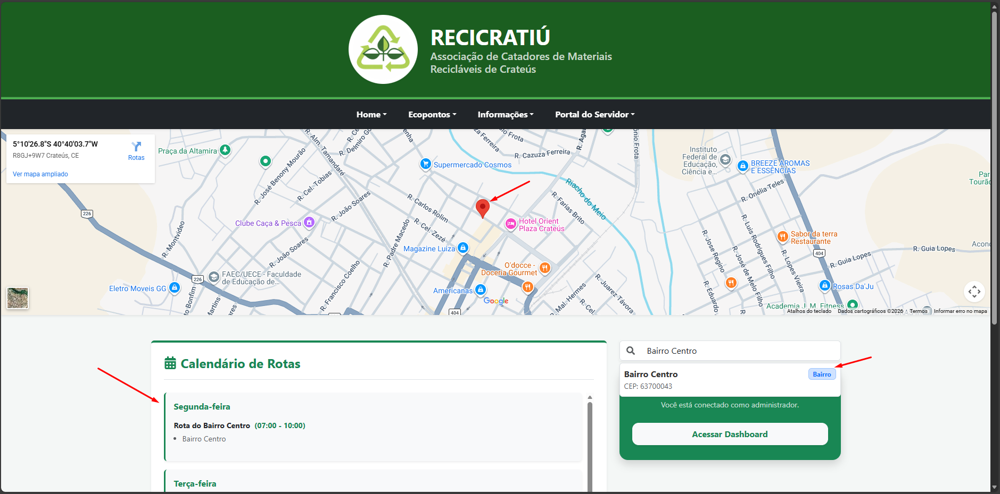
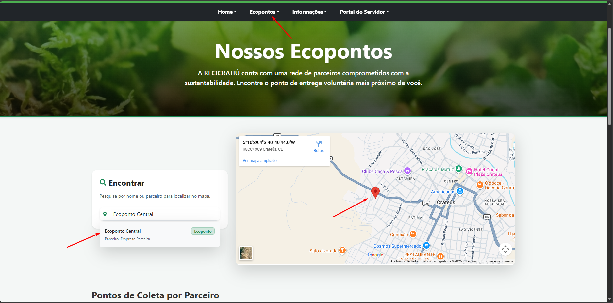
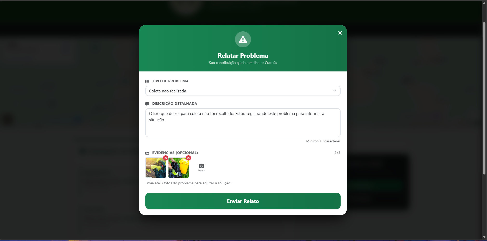
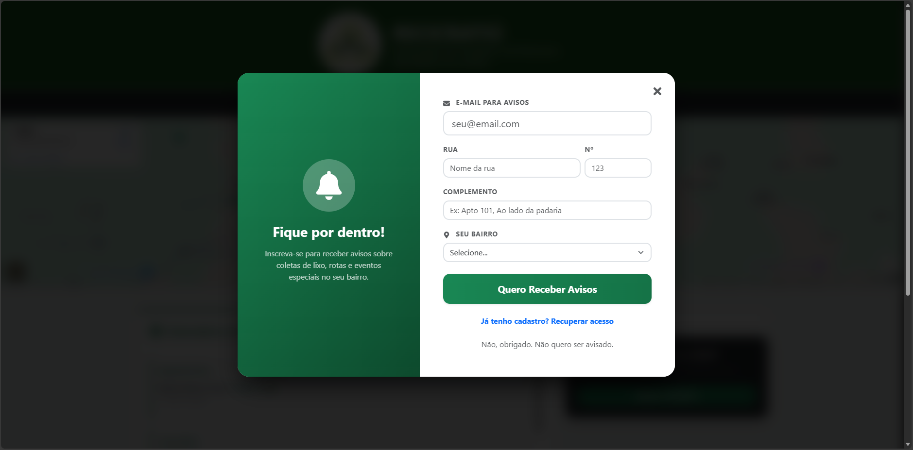
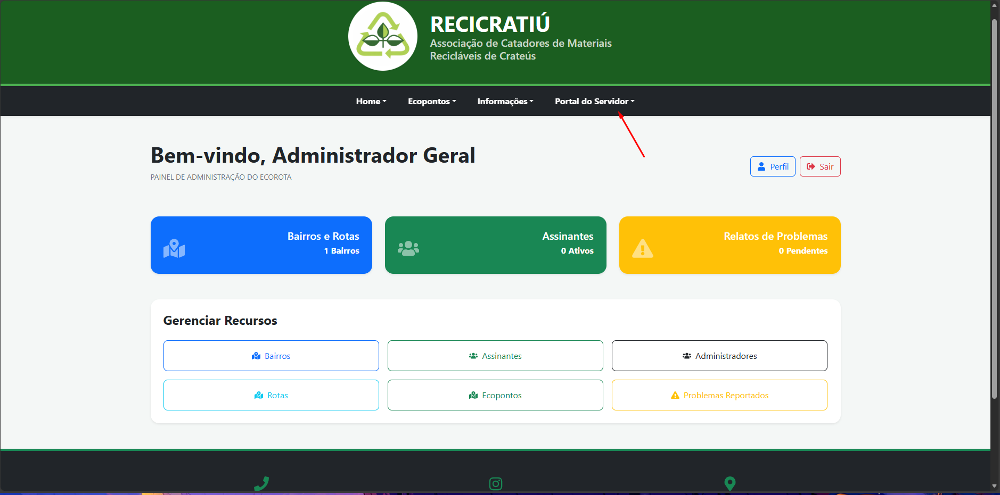
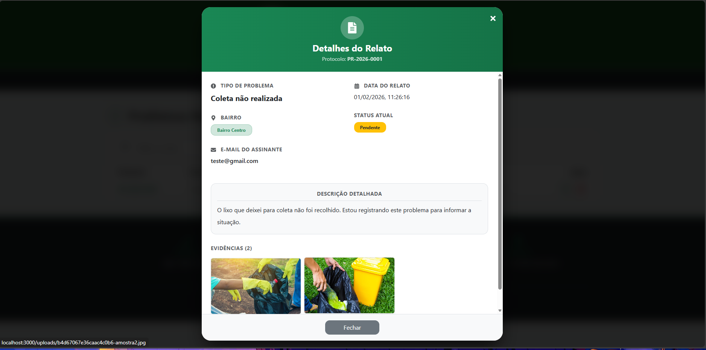

# ♻️ EcoRota

## 📌 Resumo do Projeto

O **EcoRota** é uma plataforma web inovadora projetada para transformar a gestão e o acesso à coleta seletiva de resíduos. Conectando cidadãos a ecopontos e parceiros de reciclagem, o sistema visa promover a sustentabilidade e empoderar a comunidade com informações claras.

Através de uma interface moderna e intuitiva, o EcoRota permite:
*   📍 **Localização ágil** de ecopontos e rotas de coleta via mapas interativos.
*   📢 **Reporte de problemas** urbanos diretamente pelos cidadãos.
*   🤝 **Conexão direta** entre a população e serviços de limpeza urbana.
*   📊 **Gestão administrativa** eficiente para moderadores e gestores públicos.

## 📸 Galeria do Projeto

Conheça as interfaces que compõem a experiência do EcoRota:

| Tela | Descrição |
| :--- | :--- |
|  | **Busca por Bairros**: Página inicial intuitiva permitindo que cidadãos encontrem serviços de coleta em sua região. |
|  | **Mapa de Ecopontos**: Visualização geoespacial interativa para localizar pontos de descarte correto. |
|  | **Reporte de Problemas**: Interface para que cidadãos relatem questões como lixo acumulado ou falta de coleta. |
|  | **Interação do Usuário**: Modais responsivos para ações rápidas e feedbacks do sistema. |
|  | **Painel Administrativo**: Visão geral para gestores acompanharem métricas e status do sistema. |
|  | **Detalhes de Ocorrências**: Área administrativa para análise e tratativa de problemas reportados pela comunidade. |

## 📅 Gestão do Projeto

O desenvolvimento do EcoRota foi meticulosamente acompanhado através do **GitHub Projects**, garantindo transparência e organização. Utilizamos uma estrutura de quadros **Kanban** para monitorar o ciclo de vida de cada funcionalidade.

*   **Issues**: Cada nova feature, correção ou melhoria foi documentada como uma Issue, servindo como a fonte da verdade para o que precisava ser feito.
*   **Pull Requests**: As tasks foram desenvolvidas em branches separadas e integradas via Pull Requests, que fechavam automaticamente as Issues associadas após o merge.
*   **Acompanhe o Quadro**: Você pode visualizar o histórico e o status das tarefas acessando nosso [Board no GitHub Projects](https://github.com/users/SamuelLopess03/projects/6).

## 🏗️ Arquitetura e Tecnologias

O EcoRota foi desenvolvido seguindo os princípios da **Clean Architecture** e **REST**, garantindo um sistema desacoplado, escalável e de fácil manutenção. O projeto é dividido em dois grandes pilares:

### 🎨 Frontend (Aplicação Web)
Desenvolvido como uma **Single Page Application (SPA)** moderna e responsiva.
*   **React + TypeScript**: Combinação poderosa para criar interfaces componentizadas, tipadas e seguras.
*   **Vite**: Ferramenta de build para um desenvolvimento ultra-rápido e bundles otimizados.
*   **Bootstrap 5**: Framework de UI para garantir responsividade e estética consistente.
*   **Axios**: Cliente HTTP para comunicação eficiente com a API.
*   **Deploy**: O build de produção é servido por um servidor **Nginx** de alta performance dentro de um container Docker, utilizando um processo de construção *multistage* para gerar uma imagem leve e segura.

### ⚙️ Backend (API RESTful)
Uma API robusta construída sobre Node.js, focada em segurança, performance e integridade de dados.
*   **Node.js & Express**: Base sólida para processamento assíncrono e rotas da API.
*   **TypeScript**: Garante a integridade do código e facilita a manutenção no lado do servidor.
*   **Segurança**:
    *   **JWT (JSON Web Token)**: Autenticação stateless segura.
    *   **Bcrypt**: Hashing de senhas para proteção de credenciais.
    *   **Zod**: Validação rigorosa de esquemas de entrada de dados.
*   **Arquivos**: **Multer** para gerenciamento de uploads de arquivos.
*   **Dados**: **Prisma ORM** para interação type-safe com o banco de dados **MySQL**.
*   **Deploy**: Assim como o frontend, utiliza Docker *multistage builds* para separar as dependências de desenvolvimento da produção, resultando em containers otimizados.

## 🐳 Orquestração com Docker Compose

Para garantir que o ambiente seja replicável e consistente (do desenvolvimento à produção), utilizamos o **Docker Compose** como orquestrador. Ele define e gerencia a criação dos três serviços essenciais do ecossistema EcoRota:

1.  **`backend`**: A API Node.js, construída a partir do `Dockerfile` no diretório `backend/`.
2.  **`frontend`**: O servidor web Nginx, construído a partir do `Dockerfile` no diretório `frontend/`.
3.  **`database`**: O container MySQL oficial, persistindo dados em volumes Docker gerenciados.

Com um único comando (`docker-compose up`), todo o ambiente é provisionado, as redes são configuradas e os serviços se conectam automaticamente.

## 🧪 Qualidade e Testes

A estabilidade do EcoRota é assegurada por uma estratégia de testes abrangente utilizando **Jest**:

### ✅ Testes Unitários
Focados na lógica de negócio e regras de domínio. Como não dependem de banco de dados ou redes, são extremamente rápidos e garantem que componentes individuais (como Entidades e Casos de Uso) funcionem corretamente de forma isolada.

### 🔗 Testes de Integração
Validam o fluxo completo de uma requisição. Eles garantem que a API Express receba os dados, o Prisma interaja corretamente com o banco de dados e a resposta seja a esperada. Esses testes são cruciais para assegurar que as "peças" do sistema se encaixem perfeitamente no mundo real.

## 🤝 Como Contribuir

O EcoRota é um projeto open-source e adoraríamos receber sua contribuição! Seja para corrigir um bug, sugerir uma nova funcionalidade ou melhorar a documentação, sinta-se à vontade para participar.

1.  **Abra uma Issue**: Encontrou um problema ou tem uma ideia? Abra uma issue para discutirmos.
2.  **Faça um Fork**: Crie sua própria cópia do projeto para trabalhar.
3.  **Crie um Pull Request**: Implementou sua melhoria? Envie um PR descrevendo suas alterações. Faremos o review com prazer e, se tudo estiver certo, o merge será feito!
